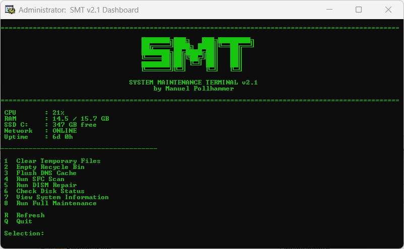
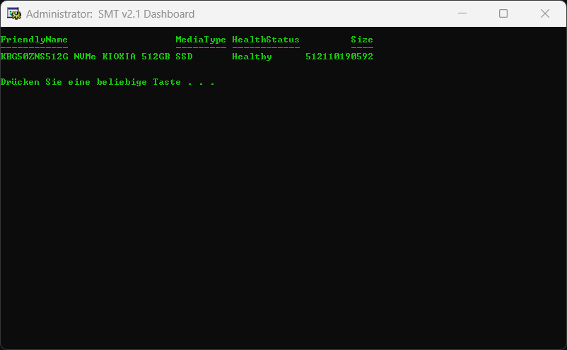

    
# System Maintenance Terminal   v2.1 - Dashboard Edition
**Minimalist system monitoring and maintenance console for Windows**  
by Manuel Pollhammer (2026)

---

## 🚀 What is SMT?
**SMT** is an ultra-lightweight, terminal-based maintenance and diagnostics dashboard for Windows systems. It combines the speed of classic Batch scripting with the deep system-level queries of PowerShell.

### 🌟 New in v2.1: Performance Dashboard
- **📊 Live Analytics:** Real-time tracking of CPU load, RAM usage, and free disk space.
- **🌐 Network Check:** Instant online/offline status via persistent background pings.
- **⏳ Uptime Tracking:** Live-calculated system operating duration (Days & Hours).
- **🎨 ANSI Interface:** High-contrast, flicker-free terminal design for professional looks.

### ✨ Core Highlights
- **Hybrid Engine:** Batch frontend handles the CLI while a silent PowerShell backend fetches CIM instances.
- **One-Click Maintenance:** Run sequential full-system cleanups with a single keypress.
- **Disk Health Scan:** Instant structural overview of physical drive media types and health status.
- **Zero Overhead:** No heavy frameworks—runs instantly directly out of the box.

### ⏳ Coming Soon
*   **🌡️ Temperature Monitor:** Live CPU core temperature tracking inside the main dashboard.
*   **📈 GPU Monitoring:** Dedicated metrics for graphics card utilization and memory usage.

---

## 🛠️ Quick Start
1. Clone or download the repository ensuring `smt.bat` and `stats.ps1` remain in the same folder.
2. Right-click `smt.bat` and select **"Run as Administrator"** (required for SFC/DISM repairs).
3. Use keys **[1-8]** for instant tools, **[R]** to refresh, or **[Q]** to exit.

---

## ⚙️ Under the Hood
SMT utilizes a smart split-architecture to bypass standard command-line limitations:
* **`smt.bat` (Frontend):** Renders the user interface, maps navigation inputs, and handles system cleanups.
* **`stats.ps1` (Backend):** Automatically triggered by the batch file. It queries system metrics via `Get-CimInstance`, formats data precisely, and returns a clean semicolon-separated string back to the loop.

---

## 📸 Screenshots

  
   
  <i>Main Performance Dashboard View</i>

  
   
  <i>Physical Disk Health and Media Type Verification</i>

---
**Developed by Manuel Pollhammer | Release 2026**

